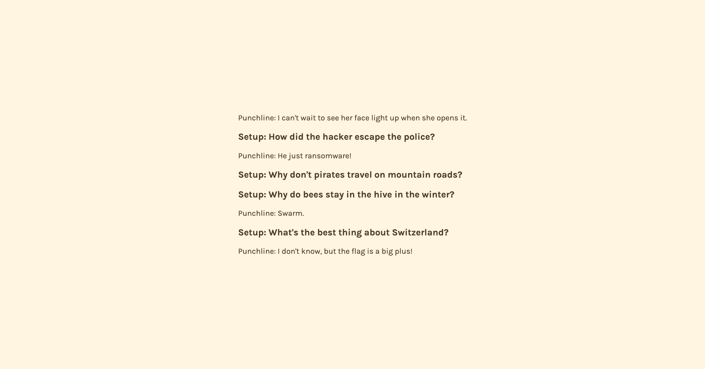

# Conditional rendering If with Logical && operator

This repository demonstrates a React application that utilizes conditional rendering with the `&&` operator to display jokes. It highlights the effective use of props and conditional logic to render content dynamically based on the presence of data.

## Overview

The app consists of reusable components that manage and render jokes. Each joke is displayed only if the relevant setup and punchline are provided, showcasing the power of conditional rendering in React.

## Key Concepts Covered

1. **Conditional Rendering** - Using the `&&` operator to render components based on conditions.
2. **React Components** - Creating reusable UI components for better organization and maintainability.
3. **Props** - Passing data to components to customize their output.

## Visual Design



## Installation

To run this project locally, follow these steps:

1. Clone the repository:

   ```bash
   git clone https://github.com/BhoomiGohil/Srimba-React-ConditionalRendering.git
   ```

2. Navigate to the project directory:

   ```bash
   cd Srimba-React-ConditionalRendering
   ```

3. Install dependencies:

   ```bash
   npm install
   ```

4. Start the development server:
   ```bash
   npm start
   ```

## Example Code

Here's a brief example of using conditional rendering in the Joke component:

```jsx
export default function Joke(props) {
  return (
    <div>
      {/* Render setup if it exists */}
      {props.setup && <h3>Setup: {props.setup}</h3>}

      {/* Render punchline if it exists */}
      {props.punchline && <p>Punchline: {props.punchline}</p>}
    </div>
  );
}
```
